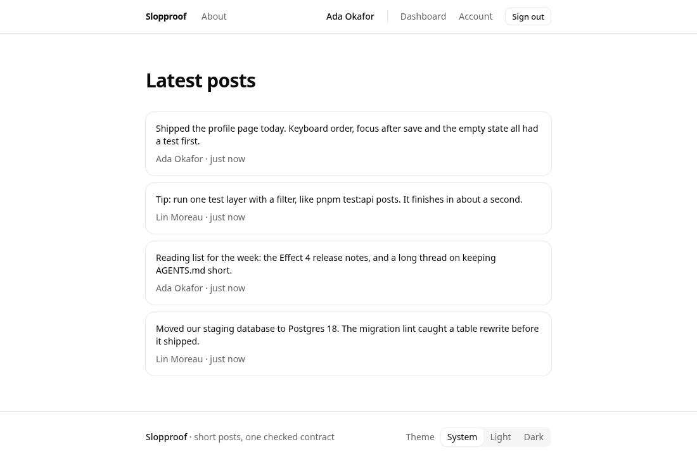

# Slopproof

A full-stack web app template for projects built with coding agents. The rules a careful team would enforce
are already checks, so when an agent breaks one, a command fails and tells the agent how to fix it.

[](https://github.com/TiagoGranelli/slopproof/actions/workflows/ci.yml)
[](LICENSE)

## The problem

When you don't say how something should be built, a coding agent builds it the most common way it has seen.
That is usually the average version: a component that queries the database directly, an endpoint with no test
for its error cases, a list that runs one query per row, a page nobody tried with a keyboard.

A new project makes this worse. It has no conventions yet, no tests to break, and nothing in the repository
that pushes back. You can write the rules in a prompt or an `AGENTS.md`, but the agent can still skip them, and
you find out in review.

Slopproof starts you with those rules written as checks. The agent runs one command before it hands the work
back. If a rule is broken, the command fails with a message that says what to do instead, and the agent fixes
it before you read the diff.

It is for people who start web projects with Claude Code, Codex or another coding agent and want a solid base
on day one: tests, boundaries, accessibility, security and a deploy path already in place.

## See it catch a mistake

We had an agent build a feature in this repository from `AGENTS.md` alone, and the checks caught three of its
mistakes: UI code importing the server, a contract change without regenerating the client, and a schema change
without a migration.

Here is the first one, recreated. Asked to show how many posts there are above the list, the agent writes a
component that reads the database:

```tsx
// src/features/posts/components/post-count.tsx
import { count } from 'drizzle-orm'
import { db } from '#/server/db/client.ts'
import { post } from '#/server/db/schema/posts.ts'

/** How many posts exist, shown above the public list. */
export async function PostCount() {
  const [row] = await db.select({ total: count() }).from(post)
  return <p>{row?.total ?? 0} posts</p>
}
```

`pnpm check` fails. Two of its jobs reject the imports, and each message says where the data should come from:


This is a real run on a scratch copy of the repository, with a few lines of pnpm and Fallow noise removed. The
other two mistakes fail the same command, in its drift job:

```text
DRIFT contract
  - `pnpm codegen` changed these files; review and commit them:
 openapi.json         | 6 +++++-
 src/sdk/types.gen.ts | 1 +
 2 files changed, 6 insertions(+), 1 deletion(-)
DRIFT migrations
  - the schema needs 0010_dry_retro_girl.sql: run `pnpm db:generate --name <slug>`
```

## What the checks cover

- One command, `pnpm check`, runs 14 jobs in about 16 seconds on a laptop, with no database and no build. A
  pre-commit hook runs the jobs your staged files touch, and CI runs all of them.
- The API has one source of truth. The OpenAPI document, the generated client, the running server and the tests
  must agree, and a check regenerates the files and fails if anything changed.
- Architecture rules are lint errors. UI code can't import the database or the server, a feature can't import
  another feature, and the API contract can't import server or UI code.
- Size and complexity have numbers: 20 lines per function (80 per component), 300 per file, two levels of
  nesting, a cognitive complexity of 15, and no duplicated blocks outside tests.
- Each repository method has a query budget: a fixed number of SQL statements whatever the data size. An N+1
  query fails a test that names the method and lists the statements it sent.
- Accessibility is tested in real browsers. Axe runs on every page and UI state, and each page's landmarks and
  keyboard tab order are checked. The end-to-end tests run in Chromium, Firefox, WebKit and two phone profiles.
- Security behavior has tests. The Content-Security-Policy allows no `unsafe-inline`, and a CSP violation fails
  any end-to-end test. CSRF, security headers, sessions and rate limits have integration tests.
- Lighthouse measures four pages on mobile and desktop, and they score 100 locally in every category the gate
  checks (SEO only on the public pages; login and the dashboard are noindex). CI fails a page below 100 in
  accessibility, best practices or SEO, or below 95 in performance, because GitHub's shared runners score an
  unchanged page 99 on mobile ([ADR 0011](docs/decisions/0011-lighthouse-over-https-http2.md)).
- Dependencies are pinned exactly and a new release waits a day before it can be installed. CI also runs
  `pnpm audit`, a license allowlist, secret scanning and a scan of the Docker image.
- The agent instructions stay short. `AGENTS.md` is under 200 lines, each multi-step workflow is a skill (new
  endpoint, migration, feature, page, auth change, dependency upgrade), and the Claude Code settings format and
  lint each edited file, refuse edits to generated files and block `git commit --no-verify`.
- Four agent eval tasks with hidden checks run in [Harbor](https://docs.harborframework.com/), so you can measure
  whether a change to the instructions helps.

Every exception to a check is a visible edit with its reason next to it, and `.github/CODEOWNERS` sends changes
to the check files to review.

## What you start with



A working app that you change into yours:

- Accounts with email and password. Sign-up is closed by default (you create users from the command line) or
  open with email verification. Password reset, a list of active sessions and account deletion are included,
  and the login form works before the JavaScript loads.
- An example feature, short posts: a public paged list and a dashboard to write, edit and delete your own. It
  goes through every layer, so the agent has a working reference for each one. You can delete it when you
  start your own feature.
- The UI details agents tend to skip: light, dark and system themes without a flash on load, a skip link,
  announcements on route changes, visible focus, field errors that screen readers announce, and support for
  Windows High Contrast. The delete confirmation traps focus, starts on "Keep it" so Enter alone never deletes,
  and returns focus to the button when it closes.
- One container to deploy, with recipes for a single server with Docker Compose and Caddy, for Fly.io and for
  Kubernetes.

The stack is TypeScript end to end. [docs/stack.md](docs/stack.md) says why each piece is there and what its
risk is, and [AGENTS.md](AGENTS.md#architecture-map) shows what lives where.

## Quick start

You need pnpm 12 and Docker. `pnpm install` downloads the Node version the project pins.

On GitHub, click **Use this template**. Or copy it without GitHub:

```sh
npx giget gh:TiagoGranelli/slopproof my-app
cd my-app
pnpm install && pnpm bootstrap && pnpm dev
```

`pnpm bootstrap` creates `.env` with a secret, starts Postgres and a local mail inbox in Docker, and applies the
migrations. The app runs at http://localhost:3000. Create an account with
`pnpm user:create you@example.com "Your Name"`, which asks for the password.

Then point your agent at the repository and ask for a feature. It finds `AGENTS.md` and the skills on its own.
Renaming the app, removing the example feature and deploying are in [docs/adopting.md](docs/adopting.md).

## Use the idea in your own stack

The code here is TypeScript, but the method works in any stack:

1. Give the API one source of truth and generate the rest from it. A check regenerates the files and fails if
   anything changed.
2. Write each rule the agent must follow as a lint rule or a test, and make its message say what to do instead.
   An agent can skip a rule that only lives in a Markdown file.
3. Put numbers on size and complexity. Agents write long functions unless something fails.
4. Test what review tends to miss: queries per request, accessibility, CSP violations, page performance.
5. Keep one fast command for all of it, run it on every commit, and have CI run the same thing.
6. Keep the agent instructions short and point them at the checks. Put multi-step workflows in skills.
7. Measure changes to the instructions with tasks that have hidden tests.

Tools that do the same jobs elsewhere: in Python, Ruff, Pyright, import-linter for boundaries and
pytest-django's `django_assert_num_queries` for query budgets. In Rails, RuboCop, Packwerk for boundaries and
Prosopite or Bullet for N+1 queries. In Go, golangci-lint with depguard. [AGENTS.md](AGENTS.md) and
[docs/agents/gates.md](docs/agents/gates.md) show how each check is set up here, which is the part worth copying.

## Status

The project is early. A tagged release and a `minimal` branch without the example feature are coming. CI runs
every job in `pnpm check`, the drift checks against Postgres, the integration and end-to-end tests in five
browser projects, contract coverage, Lighthouse, and the Docker image build and scan.

Some dependencies are pre-release. Effect 4 is a release candidate, Nitro 3 is a beta, Hey API is a `next`
snapshot, TanStack Start still calls itself a release candidate, and the project runs on TypeScript 7 and
Node 26. Upgrades are pinned and gated, one per pull request, but expect some to need work.

The agent evals run with Harbor, but results from real agents are not published yet.

The checks lower the chance that a mistake gets through. They can't prove that generated code is correct.

## Docs

- [docs/adopting.md](docs/adopting.md): from "Use this template" to your own deployed app, and taking template
  updates later.
- [AGENTS.md](AGENTS.md): the architecture map and the rules that agents and people follow.
- [docs/agents/gates.md](docs/agents/gates.md): what each check covers and how to make an exception.
- [docs/agents/evals.md](docs/agents/evals.md): running the agent evals.
- [docs/operations.md](docs/operations.md): configuration, deployment and security.
- [docs/decisions/](docs/decisions/README.md): architecture decisions.

Contributions are welcome: [CONTRIBUTING.md](.github/CONTRIBUTING.md). Security reports go through
[SECURITY.md](.github/SECURITY.md). Everyone taking part follows the [Code of Conduct](.github/CODE_OF_CONDUCT.md).

MIT license.
