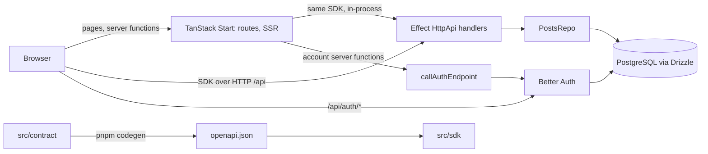

# Clean code audit (2026-09-27)

_Written when the project was called ProofStack._

ProofStack measured against Fabio Akita's
["Clean Code para agentes de IA"](https://akitaonrails.com/2026/04/20/clean-code-para-agentes-de-ia/), with a
proposal to enforce each rule using the tools the repository already runs (Oxlint, Fallow, oxfmt, AGENTS.md).
The article's reasons: a small file or function fits one tool read, a unique name makes grep cheap, a provenance
comment gives an agent the "why", shallow nesting is easier to reason about, and an error that names the
offending value and the expected shape saves a debugging round.

Scope: `src/`, `scripts/`, `tests/` and `*.config.ts` at commit `09daf37`, without `src/sdk/**` and
`src/routeTree.gen.ts` (generated) and `node_modules`. Numbers come from Oxlint 1.85.0 (one rule at a time on a
scratch config, then the proposed `.oxlintrc.json` as a whole, all under a 4 GB memory cap) and Fallow 3.29.0.
Line counts for functions and files skip blank and comment lines unless marked "raw". Grep-hit and docstring
counts come from one-off queries that are not committed.

## 1. Scorecard

| Rule (article) | Current state | Verdict |
| --- | --- | --- |
| Functions 4–20 lines | Limit is 130 (tests off). Over 20: 147 (src 31, scripts 17, tests 99, of which 67 are `describe` wrappers). Over 40: 56 (src 9, scripts 3, tests 44). Over 60: 19 (src 1, tests 18) | Not applied |
| Files under 500 lines | `max-lines` off. Over 500 raw: 1 (`scripts/check.ts`, 532); over 500 code lines: 0. Over 300 code lines: 3. Largest `src` file: `src/lib/auth.functions.ts`, 178 raw | Applied in practice, not enforced |
| One thing per function, SRP | Fallow complexity gate: 0 functions above cognitive 15 / cyclomatic 20 (max cyclomatic 17). Two scripts carry several jobs (`scripts/check.ts` 440 code lines, `scripts/lighthouse.ts` 323) | Partially |
| Specific, unique names | 124 generic bindings (`result` 85, `results` 25, `info` 11, `item` 3); `data` 79 more, mostly keys TanStack imposes. Singletons with huge grep counts: `auth` 364 hits in 96 files, `post` 364, `env` 267, `session` 240, `account` 237, `log` 166, `user` 151, `db` 110. 138 of 175 exported `src` names have 5+ hits | Partially |
| Explicit types, no `any`, no untyped functions | `no-explicit-any` and the type-aware `no-unsafe-*` rules are on: 0 findings. `strict` + `noImplicitAny`: no untyped parameter. Exported functions without a return type: 129 (src 74, of which 63 are components and hooks; server and lib 11; scripts 15; tests 40) | Mostly applied |
| No duplication | Fallow `dupes` gate at 50 tokens: 0 clone groups. At 40 tokens: 4; at 30: 20. One sub-threshold clone worth removing: the issue-path formatter in `src/server/api/middleware.ts:42` and `src/server/api/web-handler.ts:21` | Applied |
| Early returns, max 2 levels of indentation | `no-else-return` and `no-lonely-if` are on (pedantic): 0. `max-depth` off. Blocks nested deeper than 2: 36 (src 1, scripts 33, tests 2); deeper than 3: 15 (all scripts); worst depth 5 in `scripts/lighthouse.ts:250`. Callbacks nested deeper than 3: 7. Nested ternaries: 12 | Partially |
| Exception messages name the value and the expected shape | 68 `new Error` sites (src 18, scripts 50) and 8 tagged-error constructions. 19 miss the offending value where showing it is safe (list in section 5). Redactions by design: secrets, passwords, the generic `Internal error` of server functions, API validation issues (path and expected shape, never the value) | Partially |
| Keep your comments | Comment lines per code line: src 0.19, scripts 0.15, tests 0.10. Not written down as a rule | Applied, not written |
| WHY, not WHAT | Comments explain reasons, limits and incidents throughout (spot-checked in every `src` folder) | Applied |
| Docstrings with intent and one example | 88 of 101 exported `src` functions have a JSDoc block; about 3 carry a usage example. 13 have none (section 5) | Partially |
| Issue numbers / SHAs for upstream constraints | 7 links (`better-auth#9920`, `better-auth#11078`, `TanStack/router#7658`, `TanStack/router#8246`, `microsoft/playwright#42731`, `dependabot/dependabot-core#15904`, Effect PRs #8354/#8365). About 7 upstream workarounds without one (section 5) | Partially |
| Tests run with one command | `pnpm check` (fast layers, about 12 s); `pnpm build && pnpm verify:app` for the rest | Applied |
| Every new function gets a test | Coverage gate: 100% lines and branches for the modules in `COVERAGE_GATE`, a floor of 59% functions for all of `src` | Partially |
| Bug fixes get a regression test | Practised (fast-check cases become examples), not written as a rule | Partially |
| Mock I/O with named fakes | Named fakes exist in the project's idiom: `memoryPostsRepo` and `FakeAuthentication` Layers (`tests/api/harness.ts`), MSW handlers generated from the contract (`tests/component/api-mocks.ts`), alias modules in `tests/component/stubs/`, the logging mailer. Inline stubs in test bodies: 3 (`vi.spyOn(process.stdout/stderr)` in `tests/unit/lifecycle.test.ts`, `vi.stubEnv` in `tests/unit/env.test.ts`) | Applied (adapted) |
| F.I.R.S.T. | Fast layers in `check`; per-file client IPs, per-worker authors, per-run databases; `failOnFlakyTests`; `tautology` and `focused-test` guards; pre-commit hook | Applied |
| Inject dependencies | Effect Layers for `Database`, `PostsRepo`, `RateLimitStore`, `Authentication`. Module singletons: `env` (10 `src` importers; `vitest.config.ts` sets dummy values because it validates at import), `log` (10), Better Auth `auth` (3 `src` importers, one of them the Effect middleware), `db`/`pool` (`auth.ts`, `auth-rate-limit.ts`) | Partially |
| Wrap third-party libraries | Each library is owned by one to five modules: `pg` 1, `nodemailer` 1 (behind `Mailer`), `parse5` 1, `better-auth` 3 (behind `callAuthEndpoint` and `auth.functions.ts`), `drizzle-orm` 5 (schema, client, repository, rate-limit storage). UI imports of drivers and Better Auth are already lint errors. Frameworks (React, TanStack, Effect) are used directly, as their conventions expect | Applied |
| Framework conventions, small modules, predictable paths | TanStack file routes, Bulletproof React features, Fallow zones, kebab-case files, no barrel files | Applied |
| Default formatter | oxfmt, `format:check` in `pnpm check` | Applied |
| Structured JSON logs | `src/server/log.ts` writes one JSON object per line (Nitro request log, API defects, Better Auth's logger); `no-console` in `src`; scripts print plain text for people | Applied |
| Architecture diagram in the README | README has none; AGENTS.md has a table | Not applied |
| Idempotent setup script | `pnpm bootstrap` keeps an existing `.env`, fills only an empty secret, `docker compose up --wait`, idempotent migrator | Applied |

## 2. Enforcement per rule

Counts are findings of the proposed configuration (section 4) on today's code: 259 in 68 files. Only standard
tooling; no new script and no new dependency.

| Rule | Enforcement | Findings |
| --- | --- | --- |
| Function length | Oxlint `max-lines-per-function` 20 (skip blank and comments). `.tsx` 40: a component's JSX is part of its body, one element or wrapped attribute per line at printWidth 120. Tests stay off: a `describe` callback is a list of tests and Oxlint cannot tell it from a test body; test bodies get `max-statements` 15 instead, which no `describe` reaches today | 35 (src .ts 10, src .tsx 8, scripts 17) + 14 test bodies |
| File length | Oxlint `max-lines` 300 code lines everywhere. Stricter than 500 because every `src` file is under 180 and the rule should fire before a god file forms; comments do not count, so no one deletes a "why" to pass | 3 |
| SRP | Fallow `complexity` (unchanged) plus the two size rules | 0 |
| Names | Oxlint `id-denylist`: `result(s)`, `info`, `item`, `obj`, `tmp`, `temp`, `val`, `foo`, `bar`, `manager`, `helper(s)`, `util(s)`. Not `data` and `handler(s)`: Oxlint also flags object keys and type members, and those names are keys TanStack Start (`signIn({ data })`, `server: { handlers }`), TanStack Query and Effect (`handlers` in `HttpApiBuilder.group`) impose, so they would need a disable per call. `res`, `value`, `error`, `response` stay allowed: in context they are specific enough and renaming 165 `res` in tests buys no grep precision. Grep uniqueness, `data` and file names: AGENTS.md | 124 |
| Types | `no-explicit-any` and `no-unsafe-*` already on. `typescript/explicit-module-boundary-types` on `src/server`, `src/lib`, `src/contract`, `scripts`. Not on UI: components return JSX and hooks return TanStack generics that restate the generated SDK's types | 26 |
| Duplication | Fallow `dupes` as it is (50 tokens). At 40 tokens the 4 new groups are theme tokens in `app.css`, Drizzle timestamp columns and two script clones: fix the clones by hand, do not gate at 40 | 0 |
| Nesting | Oxlint `max-depth` 2. `max-nested-callbacks` 3 (the Effect idiom `Effect.fn` > `.handle()` > `CurrentUser.use()` is 3); 4 in tests (`describe` > `it.effect` > `Effect.gen` > callback). `no-nested-ternary`. `react/jsx-max-depth` 4 and `max-params` 3 complete it | 36 + 1 + 12 + 0 + 7 |
| Error messages | Oxlint `unicorn/error-message` (non-empty, 0 findings) as a floor; the content rule in AGENTS.md. No linter can check that a message names the value | 0 |
| Comments, WHY, provenance | AGENTS.md. Not checkable | — |
| Docstrings | AGENTS.md. Oxlint's `jsdoc` plugin has no `require-jsdoc`; `eslint-plugin-jsdoc` through `jsPlugins` would work but adds a dependency for 13 findings | — |
| Tests | Existing: `pnpm check`, coverage gate, guards. The regression-test and named-fake rules go in AGENTS.md | — |
| Dependency injection | Oxlint `no-restricted-imports` override on `src/server/api/**` and `src/server/posts/**`: no `pg`, no `nodemailer`, no Better Auth module, no `db`/`pool` (the `Database` service is fine). Tested: Oxlint 1.85 supports `patterns[].regex` with `importNames`. `env` and `log` stay singletons (process-wide configuration and sink) | 1 (`middleware.ts` imports `auth`) |
| Third-party wrappers | Existing `no-restricted-imports` for UI and Fallow zones, plus the override above for the Effect API | 0 |
| Formatting, logging, structure | Existing gates (`format:check`, `no-console`, Fallow zones, `filename-case`, `no-barrel-file`) | 0 |
| README diagram, setup | One-time documentation change; `pnpm bootstrap` exists | — |

Thresholds considered and rejected:

| Candidate | Findings | Why not |
| --- | --- | --- |
| `max-lines-per-function` 20 on `.tsx` | 21 components | Would split 21-line forms whose extra lines are markup |
| `max-lines-per-function` 30 on `.ts` | src 2 + 1, scripts 5 | The article's 20 costs 27 findings, most of them in scripts; affordable |
| `max-lines-per-function` 40 in tests | 44, 33 of them `describe` wrappers | Forces arbitrary `describe` splits |
| `max-depth` 3 | 15, all scripts | Fallback if the scripts' 33 findings must wait |
| `max-nested-callbacks` 2 | 203 (src 16) | Fights Effect and Vitest structure |
| `max-params` 4 | 0 | 3 is the classic limit and costs 7 options objects |
| `react/jsx-max-depth` 3 | 3 | Deepest markup is 4 (a card with a form); kept at 4 to lock the current shape |
| `vitest/max-expects` 5 | 20 | Counts assertions, not length; an E2E flow legitimately asserts many steps |
| `explicit-function-return-type` | 414 | Also flags every callback |
| `id-length` min 2 | 185 | `(a, b) =>` comparators and `i` loops are clear |
| `id-denylist` with `data` | +79 | Framework-imposed keys, see above |

## 3. Draft AGENTS.md section

In the voice of the rest of AGENTS.md. AGENTS.md is being split while this audit is written (`src/server/AGENTS.md`,
`src/features/AGENTS.md`, `tests/AGENTS.md`, `docs/agents/gates.md`): the section goes in the root file after "Where
code goes" (it applies everywhere), and if the root must stay short, the **Tests** bullet moves to `tests/AGENTS.md`
and the **Dependencies** bullet to `src/server/AGENTS.md`.

```markdown
## Code style

Code is read by agents one file at a time: a module fits one read, a name greps to its definition, and a
failure says what was wrong. `pnpm lint` enforces the numbers; the rest is for review.

- **Size.** Functions up to 20 lines, components (`.tsx`) up to 40, files up to 300, blank and comment lines not
  counted. A test body holds at most 15 statements. Over a limit, split by responsibility, not by moving lines:
  a component extracts a child component, a Layer moves its methods into functions that take the service
  (`listPublic(db, page)`), a switch that maps codes to text becomes a table.
- **Nesting.** At most two nested blocks per function and three nested callbacks (four in tests); JSX at most
  four elements deep; at most three parameters, more go in an options object. Return early; no nested ternaries.
- **Names.** A name says what the value is, specifically enough that `rg -w <name>` finds its definition and its
  uses, not unrelated code: `outcome`, `listed`, `lintRun`, never `result`, `info`, `item`, `tmp` (Oxlint
  `id-denylist`). `data` and `handler` are keys TanStack and Effect impose: keep them as keys, destructure into a
  specific name (`({ data: credentials })`), and never declare your own. No `utils` or `helpers` files: name
  the file after what it does (`src/lib/utils.ts` is shadcn's).
- **Types.** No `any`: read an untyped library value as `unknown` and narrow it (`requirePasswordToDelete` in
  `src/server/auth.ts`). Exports of `src/server`, `src/lib`, `src/contract` and `scripts` declare their return
  type; components and hooks infer theirs.
- **Errors.** A message names the offending value and the shape expected:
  `` `${name} must be an integer between ${min} and ${max} (got "${raw}")` ``. Never echo a secret, a password
  or user content: give its length, scheme or path instead (the API's `ValidationError.issues` carry the path
  and the rule, not the value). Across a trust boundary the client gets a generic message and `log` gets the
  cause (`src/lib/server-function-errors.ts`).
- **Comments.** Say why, not what. Keep existing comments when you refactor; they carry intent and
  provenance, so update them when the reason changes and delete them only with the code they explain. A line
  that exists because of an upstream bug or limit names the issue (`better-auth#9920`), the version, and when to
  remove it. Exports of `src/server`, `src/lib` and `features/*/{api,utils}` get a JSDoc sentence on intent,
  plus a one-line example when the types do not make the call obvious; the tests are the long examples.
- **Tests.** Every new function is reached by a test in the cheapest layer that can observe it, and every bug fix
  adds a test that fails without the fix. Fakes are named and defined once: a Layer in `tests/api/harness.ts`, a
  handler factory in `tests/component/api-mocks.ts`, a module in `tests/component/stubs/`. A test body does not
  build its own stub of a project module.
- **Dependencies.** The Effect API (`src/server/api`, `src/server/posts`) gets what it needs from Layers
  (`Database`, `PostsRepo`, `RateLimitStore`), so `tests/api` can provide fakes; it never imports Better Auth's
  `auth`, `db`, `pool` or a driver (Oxlint `no-restricted-imports`). `env` and `log` are the process-wide
  exceptions. A third-party library is imported by the module that owns it: `pg` by `db/client.ts`,
  `nodemailer` by `mail/smtp-mailer.ts` behind `Mailer`, Better Auth by `src/server/auth*.ts` and
  `src/server/http/`. React, TanStack and Effect are frameworks: follow their conventions instead of wrapping them.
- **Logging.** Server code logs through `log` (`src/server/log.ts`), one JSON object per line. `console` is
  for the terminal output of scripts (Oxlint `no-console`).
```

## 4. Proposed `.oxlintrc.json` diff

Measured as a whole with `oxlint` (the type-aware rules are unaffected): 259 findings, listed by rule in section
2 and by file in section 5. It replaces the `max-lines-per-function` 130 and the two `off` size rules.

```diff
@@ -77,9 +77,6 @@
     // pedantic, turned off. Style preferences that would rewrite correct code, or rules that fight a library's shape.
     "typescript/prefer-readonly-parameter-types": "off",
     "eslint/require-unicode-regexp": "off",
-    // Size limits: complexity and max-lines-per-function below measure what matters.
-    "eslint/max-lines": "off",
-    "eslint/max-depth": "off",
     "eslint/max-classes-per-file": "off",
     "import/max-dependencies": "off",
     "typescript/strict-void-return": "off",
@@ -179,7 +176,38 @@
     "react/rule-suppression": "error",
     "jsx-a11y/anchor-ambiguous-text": "error",
     "eslint/complexity": ["error", { "max": 20 }],
-    "eslint/max-lines-per-function": ["error", { "max": 130, "skipBlankLines": true, "skipComments": true }],
+
+    // Clean code for agents (AGENTS.md, "Code style"): a file and a function fit one read, nesting stays shallow,
+    // names grep. Comments are not counted, so nobody deletes a "why" to pass. Measured in docs/clean-code-audit.md.
+    "eslint/max-lines": ["error", { "max": 300, "skipBlankLines": true, "skipComments": true }],
+    "eslint/max-lines-per-function": ["error", { "max": 20, "skipBlankLines": true, "skipComments": true }],
+    "eslint/max-depth": ["error", { "max": 2 }],
+    // Effect's idiom is three deep: `Effect.fn` > `.handle(...)` > `CurrentUser.use(...)`.
+    "eslint/max-nested-callbacks": ["error", { "max": 3 }],
+    "eslint/max-params": ["error", { "max": 3 }],
+    "eslint/no-nested-ternary": "error",
+    "react/jsx-max-depth": ["error", { "max": 4 }],
+    "unicorn/error-message": "error",
+    // Names that say nothing and grep everywhere. `data` and `handler(s)` are keys TanStack Start, TanStack Query and
+    // Effect impose (`signIn({ data })`, `server: { handlers }`), so AGENTS.md covers them instead.
+    "eslint/id-denylist": [
+      "error",
+      "result",
+      "results",
+      "info",
+      "item",
+      "obj",
+      "tmp",
+      "temp",
+      "val",
+      "foo",
+      "bar",
+      "manager",
+      "helper",
+      "helpers",
+      "util",
+      "utils"
+    ],
 
     // TanStack Query and Router (ESLint plugins run by oxlint).
     "@tanstack/query/exhaustive-deps": "error",
@@ -222,6 +250,48 @@
         "shadcn/no-arbitrary-values": "off"
       }
     },
+    {
+      // A component's markup is part of its body: 20 lines of logic plus about as many of JSX at printWidth 120.
+      "files": ["**/*.tsx"],
+      "rules": {
+        "eslint/max-lines-per-function": ["error", { "max": 40, "skipBlankLines": true, "skipComments": true }]
+      }
+    },
+    {
+      // Server and plumbing modules declare what they return. UI code is exempt: components return JSX and hooks
+      // return TanStack generics that would restate the generated SDK's types.
+      "files": ["src/server/**", "src/lib/**", "src/contract/**", "scripts/**"],
+      "rules": {
+        "typescript/explicit-module-boundary-types": "error"
+      }
+    },
+    {
+      // The Effect API takes its dependencies from Layers (Database, PostsRepo, RateLimitStore), so tests/api can
+      // provide fakes. Module singletons and drivers stay out of it.
+      "files": ["src/server/api/**", "src/server/posts/**"],
+      "rules": {
+        "no-restricted-imports": [
+          "error",
+          {
+            "paths": [
+              { "name": "pg", "message": "Use the Database service (src/server/db/client.ts)." },
+              { "name": "nodemailer", "message": "Use authMail (src/server/mail/)." }
+            ],
+            "patterns": [
+              {
+                "regex": "(^|/)server/auth\\.ts$|^\\.\\./auth\\.ts$",
+                "message": "The Effect API reads Better Auth through a service provided by a Layer, not the module singleton."
+              },
+              {
+                "regex": "(^|/)db/client\\.ts$",
+                "importNames": ["db", "pool"],
+                "message": "Use the Database service, provided by a Layer."
+              }
+            ]
+          }
+        ]
+      }
+    },
     {
       // UI code and page routes: data only through the SDK or a server function (AGENTS.md, "Architecture map").
       "files": ["src/components/**", "src/features/**", "src/routes/**/*.tsx"],
@@ -288,8 +358,12 @@
       "plugins": ["vitest"],
       "rules": {
         "typescript/no-non-null-assertion": "off",
-        // A `describe` callback is a list of tests, not a function to keep short.
+        // A `describe` callback is a list of tests, not a function to keep short. Test bodies are held to 15
+        // statements instead (a `describe` holds far fewer statements than lines), and files to max-lines.
         "eslint/max-lines-per-function": "off",
+        "eslint/max-statements": ["error", { "max": 15 }],
+        // describe > it.effect > Effect.gen > callback.
+        "eslint/max-nested-callbacks": ["error", { "max": 4 }],
         "vitest/no-focused-tests": "error",
         "vitest/no-disabled-tests": "error",
         "vitest/expect-expect": [
```

The `**/*.tsx` override must stay before the `tests/**` override, so test files keep `max-lines-per-function` off
(later overrides win). Land the rules together with the refactors below; turning them on first fails
`pnpm check`.

## 5. Refactors to reach zero

Effort: S under 20 minutes, M up to an hour, L up to three hours. Renames are mechanical; everything else keeps
behavior, so the existing tests are the safety net (`describe-auth-failure.ts`, `api-error.ts`, `env.ts`,
`lifecycle.ts`, `auth-messages.ts` and `handlers.ts` are in `COVERAGE_GATE`).

### src (about 6 h)

| File | Findings | Change | Effort |
| --- | --- | --- | --- |
| `src/server/posts/repo.ts` | Layer body 55 lines | Move each method to a top-level function that takes `db` (`listPublic(db, page)`); the Layer only wires them. Error at :110 gains the author id | M |
| `src/server/api/middleware.ts` | imports `auth`; 4 nested callbacks | A `SessionLookup` service (Better Auth `getSession` in its live Layer, faked in `tests/api/harness.ts`); extract `issuePath(issue)` and reuse it in `web-handler.ts:21` | M |
| `src/server/api/handlers.ts` | `MyPostsHandlers` 25 lines | Name the update and remove handlers as functions | S |
| `src/server/http/auth-handler.ts` | `callAuthEndpoint` 27 | Split into building the request, copying cookies, reading the outcome | S |
| `src/server/auth-rate-limit.ts` | `consume` 23 | Extract the prune step | S |
| `src/server/lifecycle.ts` | `runShutdown` 21; 2 return types | Extract one step's run-and-log | S |
| `src/server/nitro/http.ts` | 24 lines, depth 3 | Extract `applySecurityHeaders` and `logRequest` | S |
| `src/server/nitro/startup.ts` | 23 | Name the `error` hook handler | S |
| `src/server/mail/auth-messages.ts` | 34; return type | One function per message | S |
| `src/server/mail/auth-mail.ts` | 3 return types | Add them; destructure `data` into `{ user, token }` | S |
| `src/server/env.ts` | `readInt` 4 params; 7 messages without the value | Options object; add `(got "…")` to :21, :23, :57, :88, the length to :30, the scheme to :63 and :85 | S |
| `src/server/log.ts`, `http/auth-endpoints.ts`, `nitro/prerender-csp.ts`, `api/in-process-client.ts`, `src/lib/content-security-policy.ts` | 1 return type each | Add them | S |
| `src/lib/api-error.ts` | `describeApiError` 28 | Message table plus a short function | S |
| `src/features/auth/utils/describe-auth-failure.ts` | 32 | Code-to-message table; `RATE_LIMITED` keeps its function | S |
| `src/lib/auth.functions.ts` | `result` ×8 | Rename (`listed`, `outcome`) | S |
| `src/features/posts/components/my-post.tsx` | `MyPost` 64, `EditPostForm` 60 | Extract the delete control and the form fields into components | M |
| `src/features/posts/components/post-list.tsx` | 58; `result` ×3 | Extract the focus-on-load hook and the list markup; rename | M |
| `src/features/auth/components/session-list.tsx` | `SessionList` 54 | Extract the list and its actions | M |
| `change-password-form.tsx` 47, `auth-form.tsx` 41, `post-composer.tsx` 41, `src/routes/_authed/dashboard.tsx` 42 | 1 each | Extract a child component (the dashboard's announcer moves to the posts feature) | S each |

### scripts (about 8 h)

| File | Findings | Change | Effort |
| --- | --- | --- | --- |
| `scripts/lighthouse.ts` | 29: 323 lines, depth 12, names 12, ternaries 2, 1 long function, 4 params | Split into policy, run and report modules; flatten the per-page loop into functions | L |
| `scripts/check.ts` | 19: 440 lines, names 16, 1 ternary, 1 long function | Move the guards into `scripts/check-guards.ts`; rename `result` per tool | L |
| `scripts/ci-local.ts` | 17: names 11, depth 3, ternaries 2, 28-line function | Extract the runner steps | M |
| `scripts/verify-app.ts` | 16: depth 5, names 10, 4 params | Extract per-runner functions; options object | M |
| `scripts/check-drift.ts` | 12: names 10, depth 1, 22-line function | Rename; extract | S |
| `scripts/deps-check.ts` | 12: `info` ×11, 1 ternary | Rename | S |
| `scripts/docker-smoke.ts` | 10: 51- and 26-line functions, depth 2, names 6; 5 messages without the value | Extract each smoke step; add exit codes and output to :142, :170, :195, :196, :201 | M |
| `scripts/edge.ts` | 8: 33-, 22- and 47-line functions, depth 1, names 4 | Extract; add the address to :204 | M |
| `scripts/app-server.ts` | 5 | Extract the start-and-wait loop | M |
| `check-migrations.ts` 6, `sbom.ts` 6, `vendor-source.ts` 6, `test-db.ts` 5, `licenses.ts` 4, `allowlist.ts` 3, `images-check.ts` 3, `ci-jobs.ts` 3, `create-user.ts` 2, `image-pins.ts` 2, `images.ts` 2, `migrate.ts` 2, `route-coverage.ts` 2, `audit.ts` 1, `bootstrap.ts` 1, `openapi.ts` 1, `report-table.ts` 1 | renames, return types, depth, params | Mechanical; add the value to `lighthouse.ts:93`, `images.ts:51`, `ci-local.ts:232`, `audit.ts:31`, `images-check.ts:64`, `create-user.ts:64/66` (length only) | S each, about 2 h together |

### tests (about 3 h)

| File | Findings | Change | Effort |
| --- | --- | --- | --- |
| `tests/component/account.test.tsx` | 322 lines | Split into sessions and password/delete files | S |
| `tests/e2e/auth-lifecycle.spec.ts` (4), `tests/e2e/flows.spec.ts` (2; 35 and 25 statements), `tests/component/account-recovery.test.tsx` (2), `my-post.test.tsx`, `post-composer.test.tsx`, `post-list.test.tsx`, `tests/e2e/csp.spec.ts`, `tests/e2e/posts-pagination.spec.ts`, `tests/integration/api-rate-limit.test.ts` | 14 test bodies over 15 statements | Extract named steps (`signUpAndConfirm(page)`, `publishAndFind(page, body)`) into the support modules | M |
| `tests/component/api-mocks.ts` (2), `tests/api/harness.ts` (1) | nested ternaries | Lookup or early return | S |
| `tests/integration/server-functions.ts` (5), `tests/db/query-budget.test.ts` (4 + 4 params), `tests/db/helpers.ts` (3), `tests/e2e/support/a11y.ts` (3 + depth 2) | names, params, depth | Rename; options object; extract | S |
| `tests/unit/lifecycle.test.ts` | inline `vi.spyOn(process.stdout.write)` | A named `captureLog()` in a shared test module (or inject the sink into `log`) | S |

### Outside lint (about 2 h)

- README: an architecture diagram (below) and a link to AGENTS.md's map. S.
- Upstream links for the workarounds without one: Better Auth's non-atomic database rate limit
  (`src/server/auth-rate-limit.ts:20`, `src/server/auth.ts:70`), its N+1 in /revoke-other-sessions
  (`tests/db/query-budget.test.ts:127`), /delete-user without a password (`src/server/auth.ts:18`), drizzle-kit's
  `--out` prefix (`scripts/check-drift.ts:94`), Playwright's request API without zstd (`tests/e2e/csp.spec.ts:16`),
  srvx's immutable request headers (`src/server/http/auth-handler.ts:118`), StrykerJS skipping nested Vitest 5
  tests (AGENTS.md, docs/plan.md). Find or file each issue. M.
- JSDoc on the 13 undocumented exports: `SignOutButton`, `SignOutAlert` (`sign-out-button.tsx`), `PostComposer`,
  `signIn`, `signOut`, `verifyEmail`, `revokeOtherSessions` (`src/lib/auth.functions.ts`), `SystemHandlers`,
  `PublicPostsHandlers`, `MyPostsHandlers` (`src/server/api/handlers.ts`), `AuthenticationLive`,
  `RequestValidationLive` (`src/server/api/middleware.ts`). S.
- Optional, not needed for zero findings: rename the grep-hostile singletons (`auth` → `authServer`, `env` →
  `serverEnv`, `log` → `logEvent`, `pool` → `pgPool`, Drizzle tables `post`/`user`/`session`/`account` →
  `postTable`… with the adapter's `schema` mapping) and the two `tests/*/helpers.ts` after what they hold. M to L,
  touches most test files.

Total: about 19 hours, parallel by directory (src, scripts, tests do not overlap).

Draft diagram for the README:


